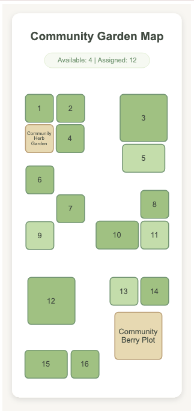
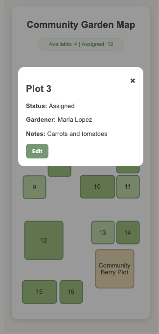
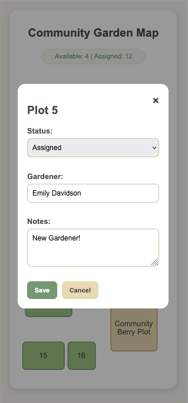
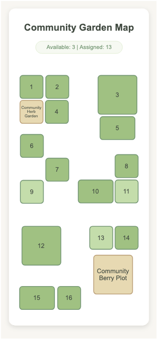

# Community Garden Plot Mapping System

The Community Garden Plot Mapping System is a web application that replaces a hand-drawn community garden map with an interactive digital system.

The application allows users to view garden plots, update plot information, and save changes to a database through a simple web interface. It demonstrates full-stack web development using Flask,SQLAlchemy, SQLite, JavaScript, HTML, and CSS.

## Screenshots

### Home Screen



The interactive garden map displays the current status of each plot.

---

### Plot Details



Selecting a plot opens a modal showing its status, assigned gardener, and notes.

---

### Edit Mode



Users can edit plot information and save changes directly to the database.

---

### Updated Plot



Changes are immediately reflected in the interface and remain saved after refreshing the page.

## Features

- Interactive SVG garden map
- Clickable garden plots
- View plot status, gardener name, and notes
- Edit and save plot information
- Visual distinction between assigned and available plots
- Shared garden areas with editing restrictions
- Data stored in a SQLite database
- Changes remain saved after the page is refreshed

## Technologies Used

- Python
- Flask
- Flask-SQLAlchemy
- SQLite
- HTML
- CSS
- JavaScript
- SVG

## Requirements

- Python 3.x
- Flask
- Flask-SQLAlchemy

## Install Dependencies

```bash
pip3 install flask flask-sqlalchemy
```

## Run the Application

```bash
python3 app.py
```

## Open

```text
http://127.0.0.1:5001
```
